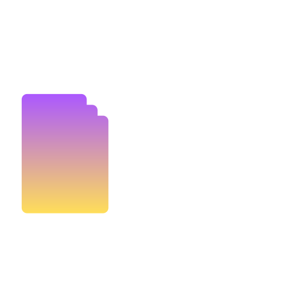

# The Giphy

The Giphy is an open-source Giphy exploring and sharing website made using the Giphy API. This project leverages the power of Vite and React to provide a fast and responsive user experience.

## Features

- Explore trending GIFs
- Search for GIFs by keywords
- Share your favorite GIFs with friends
- Responsive design for mobile and desktop

## Getting Started

Follow these instructions to get a copy of the project up and running on your local machine for development and testing purposes.

### Prerequisites

- Node.js (version 14 or higher)
- npm (version 6 or higher)

### Installation

1. Clone the repository:
	```sh
	git clone https://github.com/yourusername/the-giphy.git
	```
2. Navigate to the project directory:
	```sh
	cd the-giphy
	```
3. Install the dependencies:
	```sh
	npm install
	```

## Usage

Once the development server is running, you can access the application at `http://localhost:3000`. Use the search bar to find your favorite character and explore their profiles.

## Contributing

We welcome contributions from the community! If you'd like to contribute, please follow these steps:

1. **Fork the repository**.
2. **Create a new branch**:
    ```bash
    git checkout -b feature/your-feature-name
    ```
3. **Make your changes**.
4. **Commit your changes**:
    ```bash
    git commit -m "Add your commit message"
    ```
5. **Push to the branch**:
    ```bash
    git push origin feature/your-feature-name
    ```
6. **Create a Pull Request**.

## License

This project is licensed under the MIT License. See the LICENSE file for more details.